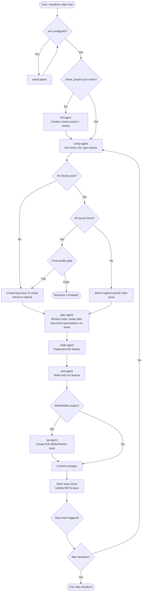

# Plan: Convert Linear Coding Agent Harness to Claude Code Plugin

**Plugin Name:** `marathon-ralph`

## Overview

Convert the Python SDK-based autonomous coding harness into an idiomatic Claude Code plugin using the **Stop hook pattern** from chief-wiggum. All work happens in subagents to keep the main context window clean.

## Design Principles

1. **Subagents for everything** - Init, verify, plan, code, test, QA all run as subagents
2. **Natural language invocation** - Like chief-wiggum, users can speak naturally or use commands
3. **User-provided spec** - App spec is provided by user, not hardcoded (sample included for testing)
4. **Comprehensive completion checks** - Beyond Linear issues: tests, lint, type checks
5. **Clean Linear workflow** - Create new linked issues for regressions, don't dirty original tickets

## Subagent Architecture

Based on analysis of `coding_prompt.md` steps:

| Agent | Responsibility | When Used |
|-------|---------------|-----------|
| **setup-agent** | First-run setup: LINEAR_API_KEY, .env, .gitignore | When env not configured |
| **init-agent** | Create Linear project + issues from app_spec | When `.linear_project.json` doesn't exist |
| **verify-agent** | Run all tests, lint, type checks on completed work | Every iteration before new work |
| **plan-agent** | Review code, create implementation plan, document assumptions | Before implementing each issue |
| **code-agent** | Implement a single feature/issue | After planning |
| **test-agent** | Write unit/integration tests for implemented feature | After coding |
| **qa-agent** | Plan E2E tests, create BDD/Gherkin specs (if web/mobile) | After test-agent |

## Iteration Flow (Mermaid)



## Stop Hook Completion Criteria

The stop hook checks ALL of the following before allowing exit:

1. **Linear Issues**: All issues in "Done" status (count from app_spec, not hardcoded)
2. **Unit Tests**: All passing (`npm test`, `pytest`, etc.)
3. **Integration Tests**: All passing (if present)
4. **E2E Tests**: All passing (if present)
5. **Lint**: No issues (`npm run lint`, `eslint`, `ruff`, etc.)
6. **Type Check**: No errors (`tsc --noEmit`, `mypy`, `pyright`, etc.)

If ANY check fails, the hook blocks exit and continues iteration.

## Plugin Structure

```
marathon-ralph/
├── .claude-plugin/
│   └── plugin.json
├── agents/
│   ├── setup.md                 # First-run environment setup
│   ├── init.md                  # Creates Linear project + issues
│   ├── verify.md                # Runs tests, lint, type checks
│   ├── plan.md                  # Reviews code, creates implementation plan
│   ├── code.md                  # Implements a single feature
│   ├── test.md                  # Writes tests for implemented feature
│   └── qa.md                    # Creates E2E BDD/Gherkin tests
├── commands/
│   ├── start.md                 # /marathon-ralph:start
│   ├── cancel.md                # /marathon-ralph:cancel
│   └── status.md                # /marathon-ralph:status
├── skills/
│   └── marathon-ralph/
│       └── SKILL.md             # Natural language: "marathon this", "build autonomously"
├── hooks/
│   ├── hooks.json
│   ├── stop-hook.sh             # Main loop + completion checks
│   └── validate-bash.sh         # Bash security allowlist
├── scripts/
│   └── setup-marathon.sh
├── .mcp.json                    # Linear + Puppeteer configs
├── templates/
│   └── app_spec.txt             # Sample spec for testing
└── README.md
```

## Implementation Steps

### 1. Update Plugin Manifest
**File:** `.claude-plugin/plugin.json` (already exists)
- Update description: "Autonomous multi-session development with Linear project management"

### 2. Create All Subagents

**File:** `agents/setup.md`
```yaml
---
name: marathon-setup
description: First-run environment setup. Configures LINEAR_API_KEY, creates .env, .gitignore, .env.example.
tools: Read, Write, Edit, Bash
model: sonnet
---
```
- Check if .env exists with LINEAR_API_KEY
- If not, prompt user for API key
- Create .env with LINEAR_API_KEY
- Ensure .gitignore excludes .env
- Create .env.example listing required variables

**File:** `agents/init.md` (from `initializer_prompt.md`)
```yaml
---
name: marathon-init
description: Creates Linear project and issues from app_spec. Used when .linear_project.json doesn't exist.
tools: Read, Write, Edit, Glob, Grep, Bash, mcp__linear__*
model: opus
---
```
- Read app_spec.txt (user-provided, dynamic issue count)
- Create Linear project and issues
- Create META issue for session tracking
- Save .linear_project.json

**File:** `agents/verify.md`
```yaml
---
name: marathon-verify
description: Runs comprehensive verification: unit tests, integration tests, E2E tests, lint, type checks.
tools: Read, Bash, Glob, Grep, mcp__puppeteer__*
model: sonnet
---
```
- Run unit tests (detect framework: jest, pytest, etc.)
- Run integration tests (if present)
- Run E2E tests (if present)
- Run linter (eslint, ruff, etc.)
- Run type checker (tsc, mypy, pyright, etc.)
- Report pass/fail for each category
- If failures: create NEW bug issues linked to originals (not reopening)

**File:** `agents/plan.md`
```yaml
---
name: marathon-plan
description: Reviews relevant code, creates implementation plan, documents assumptions on Linear ticket.
tools: Read, Glob, Grep, mcp__linear__*
model: sonnet
---
```
- Read issue description and requirements
- Spawn explore subagent to review relevant codebase areas
- Create implementation plan
- Document questions/assumptions as comment on ticket
- Output plan for code-agent

**File:** `agents/code.md`
```yaml
---
name: marathon-code
description: Implements a single feature/issue following the plan.
tools: Read, Write, Edit, Glob, Grep, Bash, mcp__puppeteer__*
model: sonnet
---
```
- Follow plan from plan-agent
- Write implementation code
- Manual verification via Puppeteer
- Commit changes with descriptive message

**File:** `agents/test.md`
```yaml
---
name: marathon-test
description: Writes unit and integration tests for implemented feature.
tools: Read, Write, Edit, Glob, Grep, Bash
model: sonnet
---
```
- Review previous commit and issue
- Check existing tests still pass first
- Write unit tests for new code
- Write integration tests if applicable
- Commit test files

**File:** `agents/qa.md`
```yaml
---
name: marathon-qa
description: Creates E2E BDD/Gherkin tests for web/mobile projects.
tools: Read, Write, Edit, Glob, Grep, Bash, mcp__puppeteer__*, mcp__linear__*
model: sonnet
---
```
- Review requirements from Linear issue
- Review implementation comments on ticket
- Create E2E tests using Gherkin syntax (if applicable)
- Use Playwright/Puppeteer for browser automation tests

### 3. Create Stop Hook
**Files:** `hooks/hooks.json`, `hooks/stop-hook.sh`

**hooks.json:**
```json
{
  "hooks": {
    "Stop": [{
      "hooks": [{
        "type": "command",
        "command": "${CLAUDE_PLUGIN_ROOT}/hooks/stop-hook.sh"
      }]
    }],
    "PreToolUse": [{
      "matcher": "Bash",
      "hooks": [{
        "type": "command",
        "command": "${CLAUDE_PLUGIN_ROOT}/hooks/validate-bash.sh"
      }]
    }]
  }
}
```

**stop-hook.sh logic:**
1. Read state from `.claude/marathon-ralph.local.md`
2. Check max_iterations limit
3. Run completion checks:
   - Query Linear API: all issues Done?
   - Run `npm test` / `pytest`: passing?
   - Run `npm run lint` / equivalent: clean?
   - Run `tsc --noEmit` / `mypy`: no errors?
4. If ALL pass: allow exit (marathon complete!)
5. Otherwise: increment iteration, determine next phase, feed back prompt

### 4. Create Setup Script
**File:** `scripts/setup-marathon.sh`

- Parse arguments: `--spec-file`, `--max-iterations`
- Create state file `.claude/marathon-ralph.local.md`:
  ```markdown
  ---
  active: true
  iteration: 1
  max_iterations: 0
  started_at: "timestamp"
  phase: "setup"
  spec_file: "path/to/spec.txt"
  ---

  <USER_PROMPT>
  ```

### 5. Create Slash Commands

**File:** `commands/start.md`
```markdown
---
description: Start autonomous marathon development
---
Run the setup script and begin the marathon loop.
Arguments: $ARGUMENTS (prompt + optional --spec-file, --max-iterations)
```

**File:** `commands/cancel.md`
```markdown
---
description: Cancel active marathon
---
Remove state file and report final progress.
```

**File:** `commands/status.md`
```markdown
---
description: Check marathon progress
---
Read .linear_project.json, query Linear, show issue counts and test status.
```

### 6. Create Skill for Natural Language
**File:** `skills/marathon-ralph/SKILL.md`

Triggers: "marathon this", "build autonomously", "run until done", "keep coding until complete"
- Like chief-wiggum's natural language invocation
- Parses user intent to extract spec file and completion criteria

### 7. Create Bash Validation Hook
**File:** `hooks/validate-bash.sh`

Convert from `security.py`:
- Allowlist: ls, cat, head, tail, wc, grep, cp, mkdir, chmod, pwd, npm, node, git, ps, lsof, sleep, pkill, ./init.sh
- Extra validation for pkill (dev processes only), chmod (+x only)

### 8. Create MCP Configuration
**File:** `.mcp.json`

```json
{
  "puppeteer": {
    "command": "npx",
    "args": ["puppeteer-mcp-server"]
  },
  "linear": {
    "type": "http",
    "url": "https://mcp.linear.app/mcp",
    "headers": {
      "Authorization": "Bearer ${LINEAR_API_KEY}"
    }
  }
}
```

### 9. Sample Spec for Testing
**File:** `templates/app_spec.txt`

Copy from `Linear-Coding-Agent-Harness/prompts/app_spec.txt` as a test sample.
Users provide their own spec file via `--spec-file`.

### 10. Documentation
**File:** `README.md`

Include:
- Installation instructions
- Environment setup (LINEAR_API_KEY)
- Usage: slash commands and natural language
- Subagent descriptions
- How completion is determined

## Files to Create/Modify

| File | Source | Action |
|------|--------|--------|
| `.claude-plugin/plugin.json` | Exists | Update description |
| `agents/setup.md` | New | Environment setup agent |
| `agents/init.md` | `prompts/initializer_prompt.md` | Init agent (creates Linear project) |
| `agents/verify.md` | New | Verification agent (tests, lint, types) |
| `agents/plan.md` | New | Planning agent (code review, assumptions) |
| `agents/code.md` | `prompts/coding_prompt.md` (partial) | Implementation agent |
| `agents/test.md` | New | Test writing agent |
| `agents/qa.md` | New | E2E/BDD test agent |
| `hooks/hooks.json` | chief-wiggum pattern | Hook configuration |
| `hooks/stop-hook.sh` | chief-wiggum + Linear + tests | Stop hook with completion checks |
| `hooks/validate-bash.sh` | `security.py` | Bash security validation |
| `scripts/setup-marathon.sh` | chief-wiggum pattern | Marathon initialization |
| `commands/start.md` | New | `/marathon-ralph:start` |
| `commands/cancel.md` | New | `/marathon-ralph:cancel` |
| `commands/status.md` | New | `/marathon-ralph:status` |
| `skills/marathon-ralph/SKILL.md` | New | Natural language invocation |
| `.mcp.json` | `client.py` | MCP server configs |
| `templates/app_spec.txt` | `prompts/app_spec.txt` | Sample spec for testing |
| `README.md` | New | Documentation |

## Key Differences from Python Version

| Aspect | Python SDK Version | Plugin Version |
|--------|-------------------|----------------|
| Runtime | Python script orchestrates | Claude Code + Stop hook |
| Context | Single coding agent | 7 specialized subagents |
| Auto-continue | Python asyncio loop | Stop hook blocks exit |
| Completion | Check Linear only | Linear + tests + lint + types |
| Regressions | Reopen original issue | Create new linked issue |
| Planning | None | Dedicated plan-agent |
| Testing | Manual only | Dedicated test + qa agents |
| Configuration | Python code | JSON/Markdown files |
| Dependencies | Python + claude-code-sdk | Just Claude Code |

## Usage

### Slash Commands
```bash
# Load plugin
claude --plugin-dir ./marathon-ralph

# Start with spec file
> /marathon-ralph:start --spec-file ./my-app-spec.txt --max-iterations 50

# Natural language also works
> "Marathon this: build a todo app using my-spec.txt"

# Check progress
> /marathon-ralph:status

# Cancel early
> /marathon-ralph:cancel
```

### Natural Language Examples (via Skill)
- "Marathon this until the app is complete"
- "Build autonomously from my-spec.txt"
- "Keep coding until all Linear issues are done"
- "Run the marathon on this project"

## Source Files Reference

| Source File | Path |
|-------------|------|
| Initializer prompt | `Linear-Coding-Agent-Harness/prompts/initializer_prompt.md` |
| Coding prompt | `Linear-Coding-Agent-Harness/prompts/coding_prompt.md` |
| App spec | `Linear-Coding-Agent-Harness/prompts/app_spec.txt` |
| Security logic | `Linear-Coding-Agent-Harness/security.py` |
| MCP config | `Linear-Coding-Agent-Harness/client.py` |
| Chief-wiggum stop hook | `chief-wiggum/hooks/stop-hook.sh` |
| Chief-wiggum setup | `chief-wiggum/scripts/setup-wiggum-loop.sh` |
| Chief-wiggum skill | `chief-wiggum/skills/wiggum-loop.md` |
